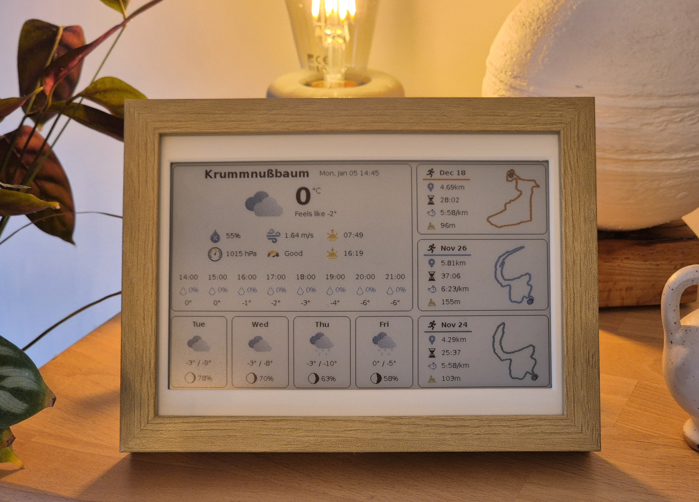

# SportyWeatherDisplay 🏃‍♂️🚴‍♀️ 🌤️
A stylish E-ink Weather and Strava Dashboard ✨

Displays weather forecasts and your recent Strava activities (including GPX routes) on an **Inky Impression 7.3" (2025 edition)** E-Ink Display. Powered by a Raspberry Pi Zero 2 W and housed in an IKEA RÖDALM picture frame, it creates a stylish, high-contrast dashboard for your home. ✒️ 🖼️




## Features ⚡️

- 🌤️ **Weather Dashboard**: Current conditions, 4-day forecast, moon phase 🌙
- 🏃 **Strava Integration**: Recent runs, rides and walks with maps and statistics 🏃‍♂️
- 🖼️ **E-ink Optimized**: High-contrast rendering with pixel-perfect icons 🎯
- 🐍 **Native Deployment**: Lightweight Python venv deployment 🚀
- ⏰ **Automated**: Runs on schedule via systemd timer ⏱️

## Technical Stack 🛠️

- **Chromium & html2image**: The dashboard is built using standard HTML/CSS and rendered to a high-quality PNG using a headless Chromium browser. This allows for complex layouts and beautiful typography that are difficult to achieve with traditional drawing libraries.
- **Pillow (PIL)**: Used for post-processing images, including drawing pixel-perfect raindrops and moon phases without anti-aliasing to ensure maximum clarity on e-ink screens.
- **Jinja2**: A powerful templating engine used to inject weather and Strava data into the HTML dashboard.
- **Stravalib & OpenWeather API**: Robust libraries and APIs to fetch your latest activities and local weather forecasts.
- **Inky Library**: Specifically tuned for the Inky Impression 7.3" to handle the 7-color dithering and display updates.

## Quick Start

### Local Development

1. **Set up configuration:**
   ```bash
   cp settings.example.json settings.json
   # Edit settings.json with your API keys
   ```

2. **Run locally (test mode, preview image only):**
   ```bash
   ./run.sh
   ```

   This will create a virtual environment, install dev dependencies (without e-ink drivers), and generate `eink_display_preview.png`.

### Raspberry Pi (Production)

**Run once manually:**
```bash
./run-pi.sh  # Installs deps and pushes to e-ink display
```

## Deployment:

See [DEPLOYMENT.md](DEPLOYMENT.md) for complete deployment instructions.

1. **On your Raspberry Pi:**
   ```bash
   # Clone the repository
   git clone https://github.com/radioburst/SportyWeatherDisplay.git
   cd SportyWeatherDisplay
   
   # Configure your settings
   cp settings.example.json settings.json
   nano settings.json
   
   # Deploy
   chmod +x deploy/deploy.sh
   ./deploy/deploy.sh
   ```

2. **Done!** Your dashboard will update automatically every 15 minutes.

## Configuration

Edit `settings.json`:
- **OpenWeather API**: Get key from [openweathermap.org](https://openweathermap.org/api)
- **Strava API**: Create app at [strava.com/settings/api](https://www.strava.com/settings/api)
- **Location**: Latitude/longitude for weather

## 3D Printed Mounts 🖨️

If you are using the IKEA RÖDALM frame, you can use these 3D printed mounts to perfectly fit the Inky Impression 7.3" display:

- [Inky Impression 2025 (PIM773) IKEA RÖDALM Mount (v1)](https://makerworld.com/en/models/1630044-inky-impression-2025-pim773-ikea-rodlam-mount?from=search)
- [Inky Impression 2025 (PIM773) IKEA RÖDALM Mount (v2)](https://makerworld.com/en/models/1457388-inky-impression-2025-pim773-ikea-rodlam-mount?from=search#profileId-1519126)

## Project Structure

```
SportyWeatherDisplay/
├── src/                    # Python source code
│   ├── *.py
│   └── templates/         # HTML/CSS templates
├── icons/                  # Weather icons
├── deploy/                 # Deployment files
├── requirements.txt        # Python dependencies
├── settings.json          # Your configuration
└── run.sh                 # Local run script
```

## Credits

**Icons**: 
- Activity icons (run, ride, walk, hike) from [Freepik](https://www.freepik.com/)
- Weather icons from [InkyPi](https://github.com/aceisace/Inky-Calendar)

## License

See [LICENSE](LICENSE)
